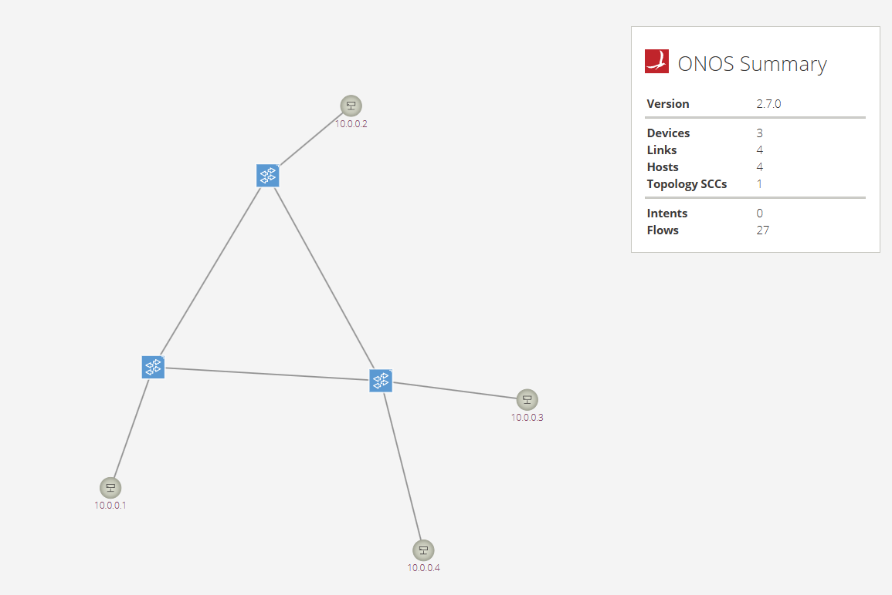
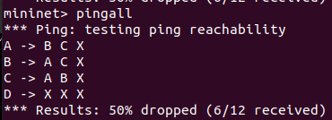

# Lab1: SDN controller & Mininet

[TOC]

## Environment

1. Ubuntu 20.04 (5.15.0-125-generic)
2. Python 2.7 & 3.8
3. Mininet (2.3.1b4 ~ master)
4. ONOS (2.7.0)
5. Java SDK (Termurin-11.0.25)
6. OpenFlow Protocol (1.3)

## Lab Requirements

1. Nodes A, B, and C can talk to one another freely.
2. **Node D has access to ports 22 and 80 of Nodes A and B, but nothing else.
3. Node D and Node C cannot talk to each other.

** **Notice: After discussing with the professor, the packets from A or B to D should be dropped. (No matter whether the packet is a TCP ACK packet.)**

## Topology



## Settings
| Hosts | IP       | Ethernet |
|-------|----------|----------|
| A     | 10.0.0.1 | random   |
| B     | 10.0.0.2 | random   |
| C     | 10.0.0.3 | random   |
| D     | 10.0.0.4 | random   |

## Result


## Implementation
### Create Topology
According to the spec of the lab, build the topology.

```python
class Lab1Topo(Topo):
    def build(self):
        # create 3 switches
        s1, s2, s3 = (self.addSwitch(f"s{i}") for i in range(1, 4))

        # create 4 hosts
        a, b, c, d = (self.addHost(chr(ord("A") + i)) for i in range(4))

        # follow the lab's graph to link
        # specify port numbers explicitly for better understanding
        self.addLink(s1, b, port1=3)
        self.addLink(s2, d, port1=2)
        self.addLink(s2, c, port1=3)
        self.addLink(s3, a, port1=1)

        # NOTE: default controller doesn't support loop
        # reference: https://github.com/mininet/mininet/wiki/Introduction-to-Mininet#multipath-routing
        self.addLink(s1, s3, port1=1, port2=3)
        self.addLink(s1, s2, port1=2, port2=4)
        self.addLink(s2, s3, port1=1, port2=2)
```

### Enable STP

Because of an existing loop among switches, enable the STP function in Open vSwitch by Mininet API to avoid broadcast storm.

```python
partial(
    OVSSwitch, protocols=args.openflow_version, failMode="standalone", stp=True
)
```

### Implement L2 switch

To let the host find the destination automatically, use the template from [ONOS apps](https://github.com/opennetworkinglab/onos/blob/master/apps/learning-switch/src/main/java/org/onosproject/learningswitch/LearningSwitchTutorial.java) to implement a simple L2 switch.

1. Create a MAC address table to store the MAC address and port.
2. Implement a `PacketProcessor` to handle IPv4 and ARP packets.
3. Save the source MAC address and source port to the MAC address table.
4. Try to find the destination port in the MAC address table by destination MAC address.
5. If yes, apply a openflow rule to switches with the lowest priority and forward it to the port. Otherwise, use flooding.

### Implement L4 firewall
Because we implement a simple L2 switch, we already fullfill the first rule. To achieve the rest of rules, we need to implement a L4 firewall. <br/>
Referring to the ACL implementation in [ONOS apps](https://github.com/opennetworkinglab/onos/blob/master/apps/acl/src/main/java/org/onosproject/acl/impl/AclManager.java), we implement a simple firewall which only accepts IP, Port, L4 Protocols and ICMP, similar to the filter layer of the input in iptable.

1. Add a set of rules via RESTful API to the firewall. If there are some hosts in the network already, the API will also apply the related rules to the switches (follow the same logic in the step c).
2. Implement a `HostListener` to handle the added and changed event.
3. While a host is being added, the firewall will apply the related rules (via IP) with higher priority to the switch connected with the host. <br/>
The priority of `ALLOW` rules will be higher than the `DENY` rules.
4. If the rule is a `ALLOW` rule, the action is set to `CONTROLLER` to let other apps to handle the packet. Otherwise, the action is empty (NOACTION).
5. If there is no matched rule in Flow Table, it will eventually follow the rules set by L2 switch, acting like the default firewall policy is `ACCEPT`.

#### Firewall Rules
1. Because the host D can only access the port 22 and 80 of the host A and B in single direction, we only need to accept these ports. (The spec doesn't specify any L4 protocols. So, we accept both TCP and UDP.)

2. With previous rules, the host C and D cannot access with each other. Therefore, we deny all traffics from/to host D directly.

```json
[
    {"srcIp":"10.0.0.4/32","dstIp":"10.0.0.1/32","ipProto":"TCP","dstTpPort":22,"action":"allow"},
    {"srcIp":"10.0.0.4/32","dstIp":"10.0.0.1/32","ipProto":"TCP","dstTpPort":80,"action":"allow"},
    {"srcIp":"10.0.0.4/32","dstIp":"10.0.0.1/32","ipProto":"UDP","dstTpPort":22,"action":"allow"},
    {"srcIp":"10.0.0.4/32","dstIp":"10.0.0.1/32","ipProto":"UDP","dstTpPort":80,"action":"allow"},
    {"srcIp":"10.0.0.4/32","dstIp":"10.0.0.2/32","ipProto":"TCP","dstTpPort":22,"action":"allow"},
    {"srcIp":"10.0.0.4/32","dstIp":"10.0.0.2/32","ipProto":"TCP","dstTpPort":80,"action":"allow"},
    {"srcIp":"10.0.0.4/32","dstIp":"10.0.0.2/32","ipProto":"UDP","dstTpPort":22,"action":"allow"},
    {"srcIp":"10.0.0.4/32","dstIp":"10.0.0.2/32","ipProto":"UDP","dstTpPort":80,"action":"allow"},
    {"dstIp":"10.0.0.4/32","action":"deny"},
    {"srcIp":"10.0.0.4/32","action":"deny"}
]
```
