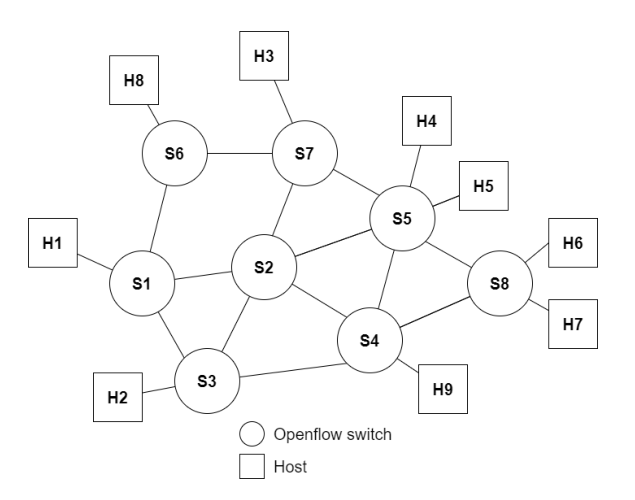
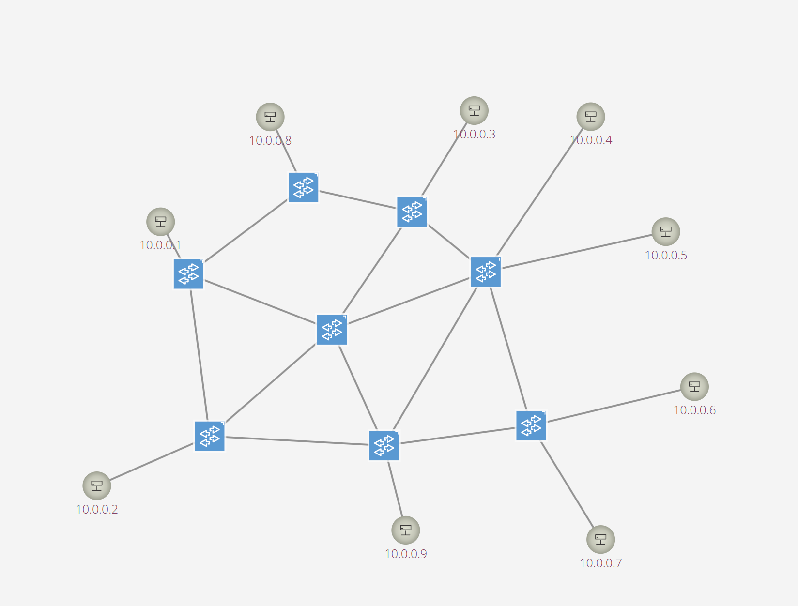
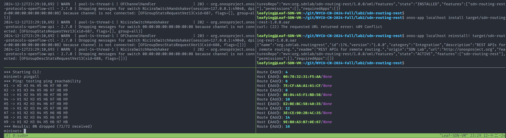
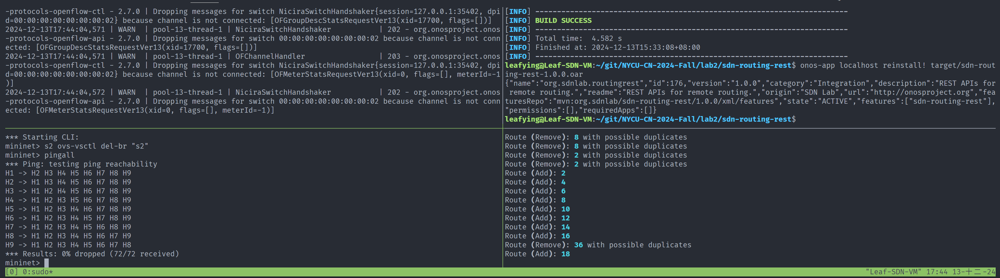
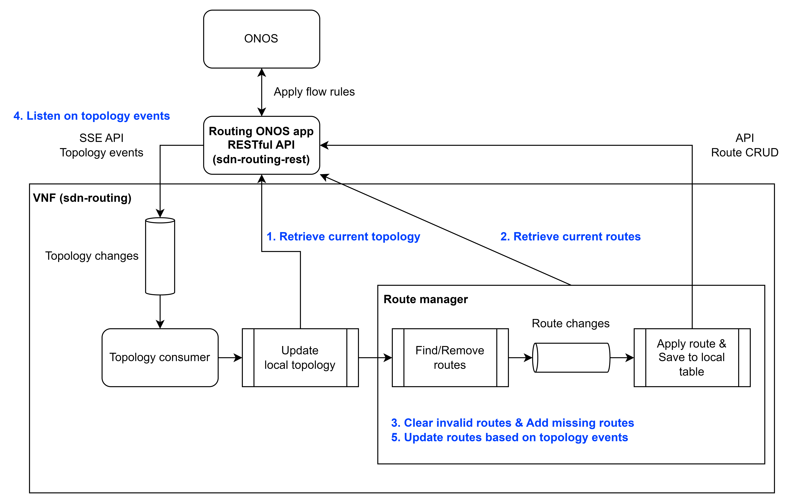
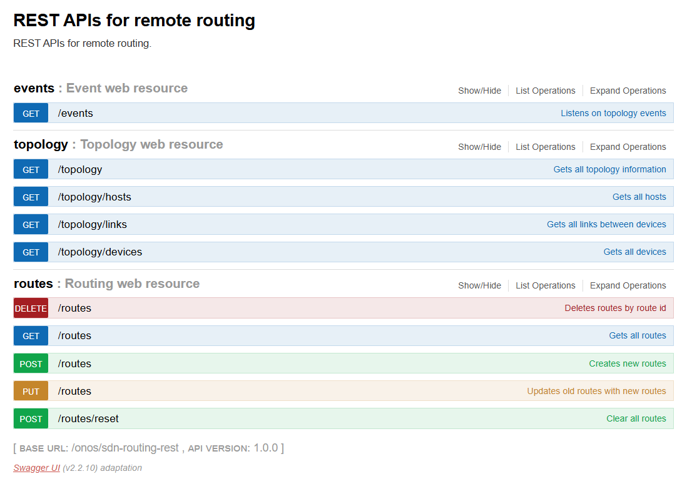

# Lab2: Routing NFV

[TOC]

## Environment

1. Ubuntu 20.04 (5.15.0-125-generic)
2. Python 2.7 & 3.8 (system)
3. Java SDK (Termurin-11.0.25)
4. Mininet (2.3.1b4 ~ master)
5. ONOS (2.7.0)
6. OpenFlow Protocol (1.3)

## Lab Requirements

1. Please design and develop a VNF of dual-path routing.
   **The dual-path routing is not practical, such as the need for flagging if the routes worked or not....**

   **So, I change to apply routes on demand directly. (multi-path routing)**

2. For each source & destination pair, find two shortest & most-disjoint paths (兩條經過最少相同路由器的路徑), and deploy the paths to all corresponding OpenFlow switches through controller (i.e., you define and develop Restful API
   as well).

## Topology

### Lab



### ONOS Controller



## Settings
| Hosts   | IP                  | Ethernet |
| ------- | ------------------- | -------- |
| H1 ~ H9 | 10.0.0.1 ~ 10.0.0.9 | random   |

## Result




## Design (multi-path routing)

#### Requirements

In normal scenario,

1. The VNF should notice the topology **changed** to apply/remove routes to switches on demand.
2. The VNF can be **stopped** without breakdown.
3. The VNF can be **resumed** without losing the previous valid routes.
4. The APP should **inform** the VNF the topology is changed.
5. The APP should **store** the routes to let the VNF to retrieve routing information.

So, the most difficult part is how to synchronize the states between the controller and VNF.

#### Architecture



#### API

| API     | Protocol |
| ------- | -------- |
| /events | SSE      |
| Others  | HTTP     |



## Setup

#### Requirements

* git
* zip
* curl
* unzip
* python2.7
* python3 (needed by Bazel)
* Bazelisk
* Maven

#### Steps

1. Install Python 3.8, 2.7, virtualenv

2. Install mininet (Python 3.8)

   ```bash
   git clone https://github.com/mininet/mininet
   mininet/util/install.sh -a
   ```

3. Install ONOS (JDK 11, Python 2.7)

   ```bash
   git clone https://github.com/opennetworkinglab/onos.git
   
   cd onos
   git checkout 2.7.0
   
   cat << EOF >> ~/.bash_profile
   export ONOS_ROOT="`pwd`"
   source $ONOS_ROOT/tools/dev/bash_profile
   EOF
   . ~/.bash_profile
   
   bazel build onos
   ```

4. Install python dependencies for sdn-routing

   ```bash
   cd sdn-routing
   python3 -m venv .venv
   
   . .venv/bin/activate
   pip install requirements.txt
   
   deactivate
   ```

5. Run ONOS `cd onos && bazel run onos-local clean`

6. Build & Install ONOS app (sdn-routing-rest)

   ```python
   cd sdn-routing-rest
   mvn clean install
   
   . ~/.bash_profile
   
   onos-app localhost reinstall! target/sdn-routing-rest-1.0.0.oar
   ```

7. Run VNF (sdn-routing)

   ```bash
   cd sdn-routing
   
   . .venv/bin/activate
   python3 run.py [--debug] 
   ```

8. Run mininet

   ```python
   # run pingall
   python3 topology.py
   
   # enter cli
   python3 topology.py --debug
   ```

## Implementation

### Create Topology

According to the spec of the lab, build the topology.

```python
class Lab2Topo(Topo):
    def build(self):
        # create 8 switches
        s1, s2, s3, s4, s5, s6, s7, s8 = (self.addSwitch(f"s{i}") for i in range(1, 9))

        # create 9 hosts
        h1, h2, h3, h4, h5, h6, h7, h8, h9 = (
            self.addHost(f"H{i}") for i in range(1, 10)
        )

        # follow the lab's graph to link
        # connect hosts
        self.addLink(s1, h1)
        self.addLink(s3, h2)
        self.addLink(s4, h9)
        self.addLink(s5, h4)
        self.addLink(s5, h5)
        self.addLink(s6, h8)
        self.addLink(s7, h3)
        self.addLink(s8, h6)
        self.addLink(s8, h7)

        # interconnection
        self.addLink(s1, s2)
        self.addLink(s1, s3)
        self.addLink(s1, s6)
        self.addLink(s2, s3)
        self.addLink(s2, s4)
        self.addLink(s2, s5)
        self.addLink(s2, s7)
        self.addLink(s3, s4)
        self.addLink(s4, s5)
        self.addLink(s4, s8)
        self.addLink(s5, s7)
        self.addLink(s5, s8)
        self.addLink(s6, s7)
```

---

### Host Discovery

By default, ONOS uses ARP/DHCP packets to identify hosts, [Network Discovery - ONOS - Wiki](https://wiki.onosproject.org/display/ONOS/Network+Discovery).

> ## Host Discovery
>
> The Device Subsystem discovers network end-hosts via ARP and DHCP messages detected as PacketIns, and describes their locations in the network in terms of Device-Port pairs referred to as **`ConnectPoints`**. The HostLocationProvider implements this function by implementing a `DeviceListener` in a similar vein as the LLDPLinkProvider.

Because of an existing loop among switches, we need to let the ARP packets broadcast correctly.

#### Loop problem

In normal case, we could just enable STP functionality.
But It causes ONOS cannot pass LLDP packets to discover all links among switches. So, we can't rely on it.

#### How to discover hosts without using STP?

If we look at the topology carefully, there is a ring among edge switches.

Thanks to ONOS provided services, `NeighbourResolutionService` and `EdgePortService`, we can act like a ARP proxy and broadcast ARP packets among edge switches only.

```java
public class DefaultNeighbourMessageHandler implements NeighbourMessageHandler {
    @Override
    public void handleMessage(NeighbourMessageContext context, HostService hostService) {
        switch (context.type()) {
        case REPLY:
            Host h = hostService.getHost(hostId(context.packet().getDestinationMAC(),
                    vlanId(context.packet().getVlanID())));

            if (h == null) {
                context.flood();
            } else {
                context.forward(h.location());
            }
            break;
        case REQUEST:
            // See if we have the target host in the host store
            Set<Host> hosts = hostService.getHostsByIp(context.target());

            Host dst = null;
            Host src = hostService.getHost(hostId(context.srcMac(), context.vlan()));

            for (Host host : hosts) {
                if (host.vlan().equals(context.vlan())) {
                    dst = host;
                    break;
                }
            }

            if (src != null && dst != null) {
                // We know the target host so we can respond
                context.reply(dst.mac());
                return;
            }

            // The request couldn't be resolved.
            // Flood the request on all ports except the incoming port.
            context.flood();
            break;
        default:
            break;
        }
    }
}
```

---

### ONOS App (RESTful API)

About the implementation details, please check the source code.

* **TopologyWebResource.java**: provide API access to the links, devices, hosts.

* **EventWebResource.java**: listen on topology changed events and provide API access to listen on it.

* **RoutingWebResource.java**: CRUD for routes and flow rules. (**NOTE: there is no routing logic in it**)

  ```java
  private FlowRule installFlowRule(Host src, Host dst, DeviceId deviceId, PortNumber srcPort, PortNumber dstPort) {
      TrafficSelector.Builder selectorBuilder = DefaultTrafficSelector
              .builder()
              .matchEthSrc(src.mac())
              .matchInPort(srcPort)
              .matchEthDst(dst.mac());
  
      if (src.vlan() != VlanId.NONE) {
          selectorBuilder.matchVlanId(src.vlan());
      }
  
      TrafficTreatment treatment = DefaultTrafficTreatment
              .builder()
              .setOutput(dstPort)
              .build();
  
      FlowRule flowRule = DefaultFlowRule.builder()
              .withSelector(selectorBuilder.build())
              .withTreatment(treatment)
              .withPriority(PacketPriority.REACTIVE.priorityValue())
              .forDevice(deviceId)
              .makePermanent()
              .fromApp(appId)
              .build();
      flowRuleService.applyFlowRules(flowRule);
      return flowRule;
  }
  
  private Set<FlowRule> installFlowRules(PathDto path) throws InvalidRouteException {
      Host src = hostService.getHost(path.src().hostId());
      Host dst = hostService.getHost(path.dst().hostId());
  
      if (src == null || dst == null) {
          throw new InvalidRouteException("Source/Destination host is not found.");
      }
  
      Set<FlowRule> flows = new HashSet<>();
      List<ConnectPointDto> points = path.points;
      for (int i = 1; i < points.size() - 1; i += 2) {
          DeviceId deviceId = points.get(i).deviceId();
          PortNumber srcPort = points.get(i).portNumber();
          PortNumber dstPort = points.get(i + 1).portNumber();
          FlowRule flowRule = installFlowRule(src, dst, deviceId, srcPort, dstPort);
          flows.add(flowRule);
      }
      return flows;
  }
  ```

  * **Route table**: store routes (only store the path)
  * **Route to flows table**: store flow rules

---

### Routing VNF (Hard to describe QQQQ)

About the implementation details, please check the source code.

#### Main entry

1. First, start listening task before retrieving current topology.

   If we start it after retrieving, we may miss some topology changes during retrieving.

2. Retrieve topology and routes from API.

3. Start route manager and topology consumer.

```python
def run(self):
    ...
    self.manager = RouteManager(self.api_client)
    ...
    # listen events eagerly to avoid race condition during loading topology
    listener_task = event_loop.create_task(self._listen_events(event_queue))

    # load topology
    print("[yellow]Loading topology and routes...")
    event_loop.run_until_complete(self._setup())
    print("[green]Loaded topology and routes successfully.")

    # run manager
    manager_task = event_loop.create_task(self.manager.run())

    # consume events
    print("[green]Listening on events... Hit '[blue]<ctrl-c>[/blue]' to exit.")
    event_loop.run_until_complete(
        asyncio.gather(
            listener_task, manager_task, self._consume_events(event_queue)
        )
    )
    ...
```

#### Components

* **Topology listener and consumer**: listen on API and take an action on event.

  ```python
  self.handlers = dict(
      topology=self._handle_topology_event,
      device=self._handle_device_event,
      host=self._handle_host_event,
  )
  
  async def _listen_events(self, queue: asyncio.Queue):
      async for event, data in self.api_client.listen_events():
          queue.put_nowait((event, data))
      raise RuntimeError("The listener is closed.")
  
  async def _consume_events(self, queue: asyncio.Queue):
      while True:
          event, data = await queue.get()
          handler = self.handlers.get(event)
          if handler is not None:
              handler(data)
          else:
              raise NotImplementedError(f"Receive unknown event, {event}.")
          queue.task_done()
  
  def _handle_topology_event(self, data: List[dict]):
      for event in data:
          event_type = event["type"]
          subject = event["subject"]
          link_type = subject["type"]
          link_state = subject["state"]
  
          if link_type != "DIRECT":
              continue
  
          if event_type == "LINK_ADDED":
              if link_state == "ACTIVE":
                  self._add_link(subject)
          elif event_type == "LINK_UPDATED":
              if link_state == "ACTIVE":
                  self._add_link(subject)
              elif link_state == "INACTIVE":
                  self._remove_link(subject)
          elif event_type == "LINK_REMOVED":
              self._remove_link(subject)
  
  def _handle_device_event(self, data: dict):
      event_type = data["type"]
      subject = data["subject"]
  
      if event_type == "DEVICE_ADDED":
          self._add_device(subject)
      elif event_type == "DEVICE_REMOVED":
          self._remove_device(subject)
      elif event_type == "DEVICE_AVAILABILITY_CHANGED":
          if data["availability"]:
              self._add_device(subject)
          else:
              self._remove_device(subject)
  
  def _handle_host_event(self, data: dict):
      event_type = data["type"]
      host = data["subject"]
  
      if event_type == "HOST_ADDED":
          self._add_host(host)
      elif event_type == "HOST_MOVED":
          prev_host = data["prevSubject"]
          self._remove_host(prev_host)
          self._add_host(host)
      elif event_type == "HOST_REMOVED":
          self._remove_host(host)
  ```

* **Topology graph**: store topology in order to find shortest path. (use `networkx` python library)

* **Route manager**

  * Find the shortest path by dijkstra and add new routes.

    ```python
    def _find_path(self, net: nx.DiGraph, src: str, dst: str) -> Optional[List[str]]:
        assert isinstance(src, str) and isinstance(dst, str)
        try:
            return nx.shortest_path(net, src, dst)
        except nx.NetworkXNoPath:
            return None
    ```

    ```python
    def _add_route(self, net: nx.DiGraph, src: ConnectPoint, dst: ConnectPoint) -> bool:
        if self.routes[src][dst] is not None:
            raise RuntimeError(f"The route between ({src}, {dst}) already exists.")
    
        # find the shortest path
        path = self._find_path(net, src.id, dst.id)
        if path is None:
            return False
    
        # create a route based on the path
        route = Route.from_path(net, path)
    
        # add the route to local table
        # route id will be updated soon
        devices = route.devices
        self.routes[route.src][route.dst] = route
        for src_device, dst_device in zip(devices[:-1], devices[1:]):
            self.link_to_routes[src_device][dst_device].add((route.src, route.dst))
    
        # add a route
        self.route_queue.put_nowait((route, Action.CREATE, None))
        return True
    
    def _remove_route(
        self,
        net: nx.DiGraph,
        src: ConnectPoint,
        dst: ConnectPoint,
        update_after_remove: bool = True,
    ) -> bool:
        def __callback():
            self.update_missing_routes(net)
    
        if src in self.routes and dst in self.routes[src]:
            route = self.routes[src][dst]
        else:
            return False
    
        if route is None:
            return False
    
        callback = None
        if update_after_remove:
            callback = __callback
    
        # delete route
        self.route_queue.put_nowait((route, Action.DELETE, callback))
        return True
    ```

  * Remove invalid routes and apply new routes.

    ```python
    self.action_handlers = {
        Action.CREATE: self._add_batch_routes,
        Action.DELETE: self._remove_batch_routes,
    }
    
    async def _consume_route_changes(self):
        prev_action = Action.CREATE
        routes = []
    
        # execute batch actions in these conditions
        # 1. same consecutive actions
        # 2. queue is empty
        while True:
            route, action, callback = await self.route_queue.get()
    
            # execute batch actions if 1.
            if prev_action != action:
                func = self.action_handlers[prev_action]
                await func(routes)
                routes = []
    
            routes.append(route)
    
            self.route_queue.task_done()
            if self.route_queue.empty():
                func = self.action_handlers[action]
                await func(routes)
                routes = []
    
            if callable(callback):
                callback()
    
            prev_action = action
    
    async def _add_batch_routes(self, routes: List[Route]):
        if len(routes) == 0:
            return
    
        print("Route (Add):", len(routes))
    
        # remote request
        content = [route.as_dict() for route in routes]
        raw_routes = await self.api_client.add_routes(content)
    
        # update local table
        for route, raw_route in zip(routes, raw_routes):
            route = dataclasses.replace(route, id=raw_route["id"])
            # devices = route.devices
    
            # critical
            self.routes[route.src][route.dst] = route
            # for src_device, dst_device in zip(devices[:-1], devices[1:]):
            #     self.link_to_routes[src_device][dst_device].add((route.src, route.dst))
    
    async def _remove_batch_routes(self, routes: List[Route]):
        if len(routes) == 0:
            return
    
        print("Route (Remove):", len(routes), "with possible duplicates")
    
        # remote request
        content = [route.as_dict() for route in routes]
        await self.api_client.delete_routes(content)
    
        # update local table
        for route in routes:
            devices = route.devices
            # critical
            for src_device, dst_device in zip(devices[:-1], devices[1:]):
                self.link_to_routes[src_device][dst_device].discard(
                    (route.src, route.dst)
                )
            if route.src in self.routes and route.dst in self.routes[route.src]:
                self.routes[route.src][route.dst] = None
    ```
